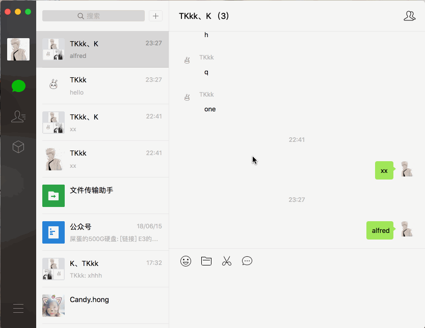
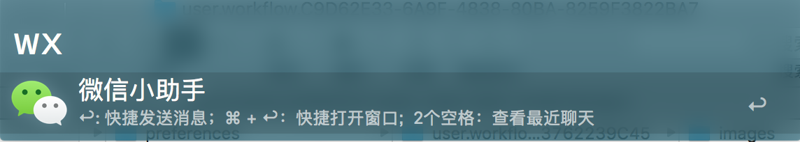
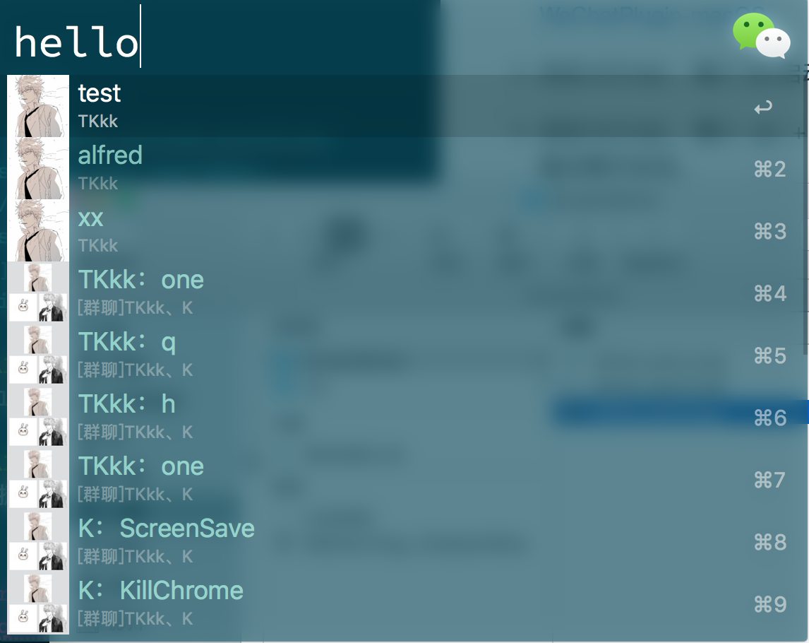

## wechat workflow for Alfred

  
   
 
 
一款让你不用打开微信就能聊天的`alfred workflow`

---

### 功能
* 快速搜索微信好友、群聊
* 快捷发送消息 
* 快捷打开聊天窗口
* 支持搜索好友，匹配昵称、备注、微信号、国家、省份、市。
* 支持搜索群聊，匹配群聊昵称、群成员昵称、群成员备注名、群成员微信号
* **支持搜索最近聊天，输入wx (2个空格)即可**

---

### Demo 演示

---

### 使用
* 下载该 [wechat-alfred-workflow](https://github.com/TKkk-iOSer/wechat-alfred-workflow/releases) & [WeChatPlugin-macOS](https://github.com/TKkk-iOSer/WeChatPlugin-MacOS)

* 启动`Alfred`，输入`wx`启动该 workflow。

* 启动`Alfred`，输入 `wx` + `空格` 键，快捷打开最近聊天会话。

* 搜索到好友，点击 `Enter` 键，并输入内容，则发送消息给好友(此时可看到下方30条最新聊天记录)。

* 搜索到好友，点击 `Command + Enter` 键，快捷打开聊天窗口。

---

### 依赖

* [Alfred-Workflow](http://www.deanishe.net/alfred-workflow/index.html)

---

#### 听说你想请我喝下午茶？😏
 
&nbsp;&nbsp;&nbsp;

